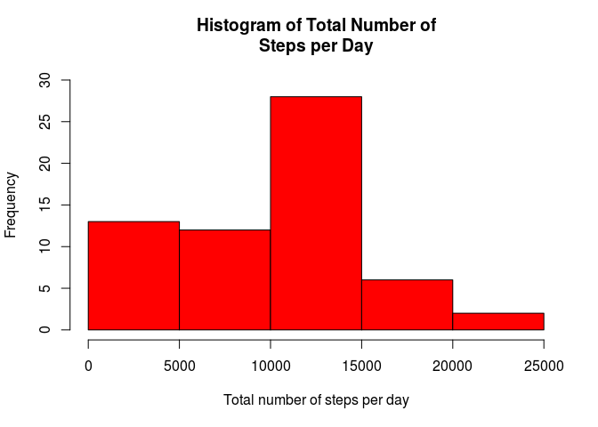
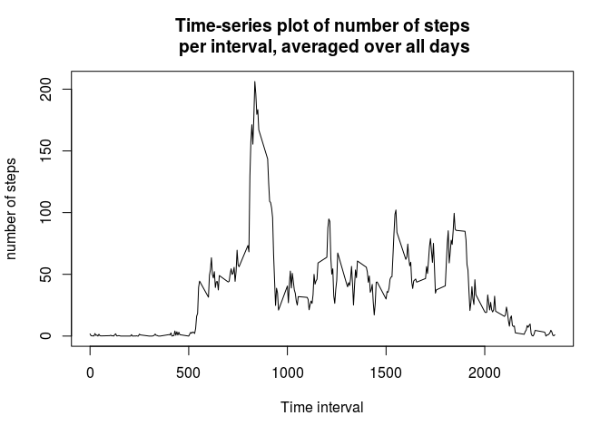
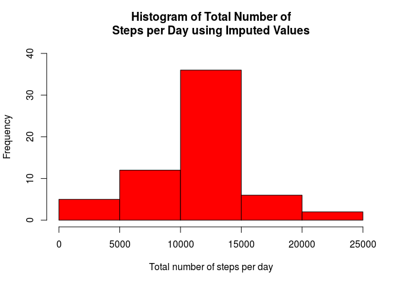
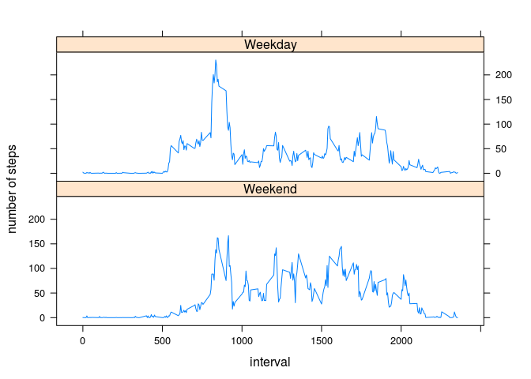

# Reproducible Research: Peer Assessment 1


## Loading and preprocessing the data
First we read the data using the *read.csv* function. But since the datafile is zipped we use the *unz* function to first unzip the datafile and then pass it to the reading function. At this stage no preprocessing seems to be necessary.

```r
data <- read.csv(unz("activity.zip", "activity.csv"))
```


## What is mean total number of steps taken per day?
For this part we need to compute the sum of steps taken in each day and then compute the mean and median on the results. To compute the sum of steps per day, we will use the ***group_by*** and ***summarize*** functions from the ***dplyr*** library. First we group the data based on the date, and then for each date (day) we use the ***sum*** function inside the ***summarize*** to form a new column containing total number of steps per day.  
After computing this new table we use the ***hist*** function from the R base graphics to plot the histogram of total number of steps per day. We can also use options like ***col*** and ***ylim*** to make the histogram aesthetically more representable.  
We can then use the ***mean*** and ***median*** functions to compute the mean and median of the total number of steps taken per day.

```r
library(dplyr)
```

```
## 
## Attaching package: 'dplyr'
```

```
## The following objects are masked from 'package:stats':
## 
##     filter, lag
```

```
## The following objects are masked from 'package:base':
## 
##     intersect, setdiff, setequal, union
```

```r
dataByDate <- group_by(data, date)
dataByDate <- summarize(dataByDate, steps = sum(steps, na.rm = T))
hist(dataByDate$steps, xlab = "Total number of steps per day", main = "Histogram of Total Number of\nSteps per Day", col = "red", ylim = c(0, 30))
```

<!-- -->

```r
meanTotal <- mean(dataByDate$steps, na.rm = T)
meanTotal
```

```
## [1] 9354.23
```

```r
medianTotal <- median(dataByDate$steps, na.rm = T)
medianTotal
```

```
## [1] 10395
```
We can see that mean for the total number of steps per day is 9354.2295082 and the median is 10395. The median being larger than the mean.  

## What is the average daily activity pattern?
Now we need to take the average of number of steps taken during each interval for all days. To perform this computation, we again use the ***group_by*** and ***summarize*** methods from the ***dplyr*** package; but this time we group the data by the interval ID rather than the date (remember we are averaging over all days for each interval!). Since there are missing values in our data, we need to use the ***na.rm = TRUE*** option, while computing the mean. 
We use the ***plot*** function from the R base graphics to plot the mean over all days of steps for each interval. We have used the ***type = "l"*** option to make it a line plot.

```r
dataByInterval <- group_by(data, interval)
dataByInterval <- summarize(dataByInterval, steps = mean(steps, na.rm = T))
plot(dataByInterval$interval, dataByInterval$steps, type = "l", xlab = "Time interval", ylab = "number of steps", main = "Time-series plot of number of steps\n per interval, averaged over all days")
```

<!-- -->

```r
maxInterval <- dataByInterval[which.max(dataByInterval$steps),]$interval
maxInterval
```

```
## [1] 835
```
In the data processed in this step we can find the interval with the highest average of steps. This point corresponds to the x-coordinate of the maximum point in the plot. We use the ***which.max*** function to find the index of the row in the dataframe that contains the maximum for the mean of steps, then extract the interval ID for that row. We can see that in interval 835 we have had the maximum mean of steps.


## Imputing missing values
We use the ***rowSums*** function to compute the number of rows that contain a missing value.  
The only column with missing values in our data is **steps**. We use the average number of steps for each interval, computed in previous step, to replace the missing values. For this purpose we use a ***for*** loop, to go over each row in the dataframe and check whether the "steps" column for that row is a missing value or not. If the value in that cell is ***NA***, we substitute it with the value from the table that we computed in previous step.

```r
missingValues <- sum(rowSums(is.na(data)))
missingValues
```

```
## [1] 2304
```

```r
imputedData <- data
for (row in 1:nrow(data)) {
        if (is.na(imputedData[row, "steps"])) {
                interval <- imputedData[row, "interval"]
                imputedData[row, "steps"] <- dataByInterval[dataByInterval$interval == interval, "steps"]
        }
}
```
There were initially 2304 values missing from the data that we imputed.  
After imputing the missing values, we repeat the same operation we performed in the first step to plot a histogram of the total number of steps per day and to compute the mean and median of these values.

```r
imputedDataByDate <- group_by(imputedData, date)
imputedDataByDate <- summarize(imputedDataByDate, steps = sum(steps))
hist(imputedDataByDate$steps, xlab = "Total number of steps per day", main = "Histogram of Total Number of\nSteps per Day using Imputed Values", col = "red", ylim = c(0, 40))
```

<!-- -->

```r
meanImputed <- mean(imputedDataByDate$steps)
meanImputed
```

```
## [1] 10766.19
```

```r
medianImputed <- median(imputedDataByDate$steps)
medianImputed
```

```
## [1] 10766.19
```
The mean and median computed in these step are both 1.0766189\times 10^{4}. Note that these values have both changed from the dataset with missing values (mean: 1.0766189\times 10^{4} vs 9354.2295082, and median: 1.0766189\times 10^{4} vs 10395.  


## Are there differences in activity patterns between weekdays and weekends?
We need to find out what days in the dataset corresond to weekdays and what days correspond to weekends. To achieve this goal, we first transform the date column of the dataset to Date datatype. Then we pass the transformed dates to the ***weekdays*** function which gives us the name of the days. We initialy store the name days in a new column called ***dayType*** in the dataframe. But then we convert these values to one of the two factor values ***weekend*** or ***weekday*** based on the name of the day.  

```r
imputedData <- transform(imputedData, date = as.Date(imputedData$date, "%Y-%m-%d"))
imputedData$dayType <- weekdays(imputedData$date)
imputedData$dayType <- factor((imputedData$dayType %in% c("Saturday", "Sunday")), 
                              levels = c(TRUE, FALSE), labels = c("Weekend", "Weekday"))
```
Now that we have successfully computed the factor column indicating whether a given row of data pertains to a weekday or to a weekend,  we again use the ***group_by*** and ***summarize*** function to compute the mean of steps. But this time we group the data by both interval ID and the type of the day (weekend or weekday). We then use the ***xplot*** function from the ***lattice*** graphics for the conditional plot of the mean over days of steps for each interval, conditioned on type of the day. Since the xyplot by default plots these conditioned plot in two panels placed side by side, we use the ***layout*** option to draw the panels on top of each other.

```r
imputedDataByDayTypeInterval <- group_by(imputedData, dayType, interval)
imputedDataByDayTypeInterval <- summarize(imputedDataByDayTypeInterval, steps = mean(steps))
library(lattice)
par(mfrow = c(2, 1))
with(imputedDataByDayTypeInterval, xyplot(steps~interval|dayType, type = "l", ylab = "number of steps", 
                                        layout = c(1,2)))
```

<!-- -->
